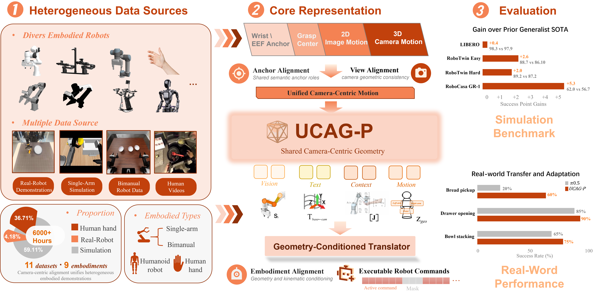
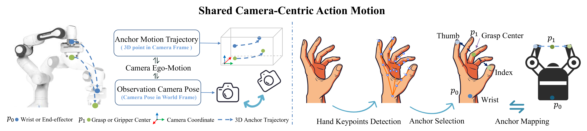
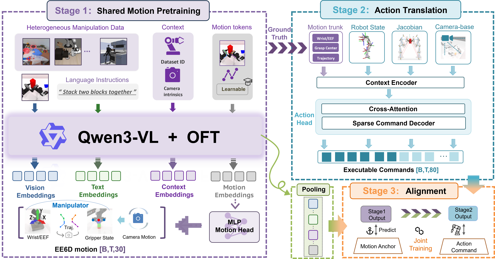
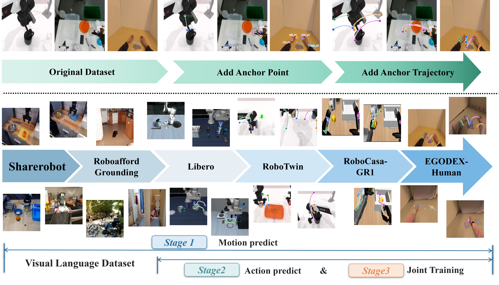
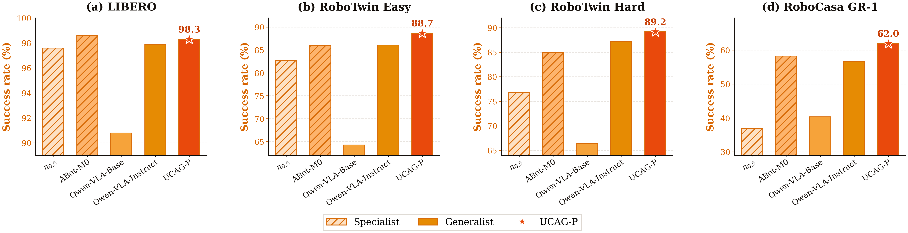
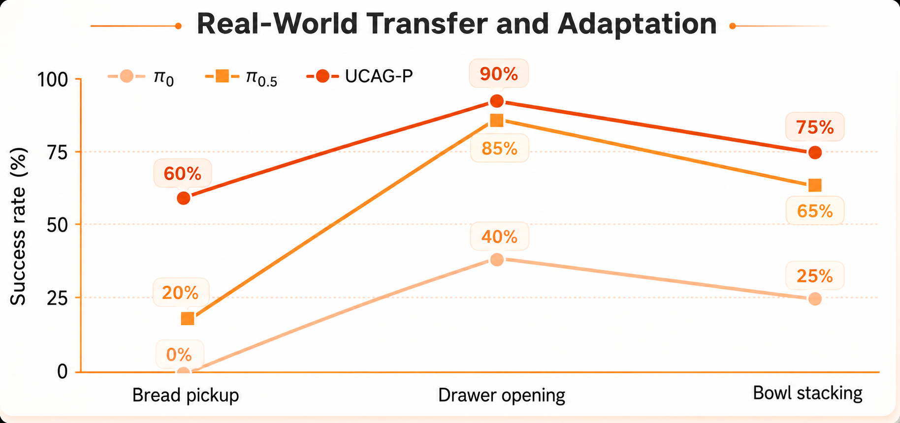

# UCAG-P: Unified Camera-Centric Action Geometry Pre-training

<p align="center">
  <a href="https://arxiv.org/pdf/2608.26058"></a>
  <a href="https://public-bots.github.io/UCAG-P/"></a>
  
</p>

This repository hosts the project materials for **UCAG-P**, a unified camera-centric action formulation for heterogeneous embodied manipulation. UCAG-P represents manipulation through camera-observable anchor motion and translates shared geometric predictions into embodiment-specific robot controls.

## Model

<p align="center">
  
</p>

<p align="center">
  <b>UCAG-P overview.</b> Heterogeneous robot and human demonstrations are aligned in a shared camera-centric action space, learned by one policy, and translated into executable controls for different embodiments.
</p>

## Unified Action Representation

<p align="center">
  
</p>

<p align="center">
  <b>Camera-centric action geometry.</b> Wrist and grasp-center anchors provide visual grounding and spatial information shared by human hands and robot end effectors.
</p>

## Method

**Share the geometry. Translate the execution.** UCAG-P separates the representation that should be shared from the execution details that should remain embodiment-specific.

<p align="center">
  
</p>

## Data

<p align="center">
  
</p>

<p align="center">
  <b>Heterogeneous data pipeline.</b> Robot, simulation, and human demonstrations are augmented with anchor points and trajectories before staged motion and action learning.
</p>

## Results

<p align="center">
  
</p>

<p align="center">
  <b>Simulation benchmarks.</b> A single UCAG-P checkpoint is evaluated across single-arm, bimanual, and humanoid manipulation settings.
</p>

<p align="center">
  
</p>

<p align="center">
  <b>Real-world transfer.</b> UCAG-P improves bread pickup, drawer opening, and bowl stacking on the Piper robot.
</p>

## News

- **[2026/08/23]** UCAG-P repository and project page released.

- **[2026/08/26]** UCAG-P released on arXiv as [arXiv:2608.26058](https://arxiv.org/abs/2608.26058).

## Code

The training, inference, and evaluation code will be released soon.

## Project Page

Videos and additional qualitative results are available at:

<https://public-bots.github.io/UCAG-P/>

The static website source is maintained in [`web-page/`](web-page/).

## Citation

```bibtex
@article{xu2026ucag-p,
  title={One Policy, Many Embodiments: Unified Camera-Centric Action Geometry Pre-training for Heterogeneous Embodied Manipulation},
  author={Shaoqing Xu and Fang Li and Guozhi Zhan and Zhixiang Duan and Yuhan Wang and Yuechen Luo and Shengyin Jiang and Hanbing Li and Zhiying Du and Longlong Wang and Longmei Jiang and Weixiang Liang and Ying Gong and Yong Pan and Ziping Zhao and Zhiyuan Chen and Yangwei You and Kun Ma and Qinyuan Liu and Hangjun Ye and Zhi-xin Yang},
  journal={arXiv preprint arXiv:2608.26058},
  year={2026}
}
```
